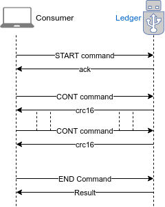

# Protocol

## About

This doc describes the protocol to be used to communicate with the app in this repo.

## Overview

The ledger implementation follows the [APDU Protocol](https://en.wikipedia.org/wiki/Smart_card_application_protocol_data_unit). Due to the limitation 256 bytes that can be sent through the transport channel, a higher level protocol have been built to address big tx signing (33 votes) or message signing.

## Result Response Protocol
All the responses from ledger follow this data protocol.

 * Byte `0`: defines the number of elements encoded in response.
 * Byte `1`: defines the number of bytes the first element have. (`N`)
 * Byte `2:N`: first element of data
 * Byte `N+1`: number of bytes of 2nd element (`M`)
 * Byte `N+2:N+2+M`: number of bytes of 2nd element
 * ...

**Example**
Lets say we have 2 elements in the response. One being `00aabb` the other `1122`. Then you would have:
```
 2 -> # of elements
  3 -> # of bytes of `00aabb`
   00aabb -> data
         2 -> # of bytes of `1122`
          1122 -> data
```

## Encapsulation Protocol Commands


### Start Command

This command is used to initiate a communication channel with the ledger. The *Data* payload will represent the # of bytes (16BigEndian) that the following payload will occupy in memory.

**Command**

| *CLA* | *INS*  | *P1*  | *P2* | *Lc* |  *Data*   | *Le*  |
|-------|--------|-------|------|------|-----------|-------|
|   E0  |   59   |   0   |   0  |  2   | see below |       |

**Example**

If the data that follows the start command is 300 bytes (012c) long then:
```
E0 -> CLA
  59 -> INS
    00 -> P1 + P2
      2 -> Lc
       012c -> Data
```

### CONT command

The continuation command needs to be sent after the start command has been sent.

It's designed to ensure data consistency when sending big chunks of data to ledger.

The `CONT` command can be sent multiple times but data sent should never exceed the amount specified during `START` request.

**Request**

| *CLA* | *INS*  | *P1*  | *P2* |  *Lc*  |  *Data*   | *Le*  |
|-------|--------|-------|------|--------|-----------|-------|
|   E0  |   5A   |   0   |  0   | length |   chunk   |       |

**Response**

The response will follow the Response Protocol and will only contain the 16LittleEndian CRC16 of *all __data__* sent since `START`.

### END Command

The end command will close the communication channel and let ledger process the entire request.

**Request**

| *CLA* | *INS*  | *P1*  | *P2* |  *Lc*  |  *Data*   | *Le*  |
|-------|--------|-------|------|--------|-----------|-------|
|   E0  |   5B   |   0   |  0   |   0    |           |       |

**Response**

The response will follow the Response protocol and will contain the result(s) of the payload processing.

## DPoS commands

All DPos Commands must be sent through the `Encapsulation Protocol` as specified above.

All commands will accept bip32 path as input parameter. BIP32 Path is encoded using **hardened** keys encoded in BigEndian Format.

### Get Public Key/Address
This command let you have the publickey associated to a specific bip32 path.
```
 04 -> command
   x -> number of paths in bip32 string
    x*4 -> bigendian uint32 paths
```

The **result** will encode both publicKey and address using the *Result Response Protocol*

### Signing

With the signing commands you can sign both transactions and messages.

**Request**

|  Description                       | Length (bytes) |             Info              |
|------------------------------------|----------------|-------------------------------|
| Command                            |       1        |  05 (sign tx) 06 (sign msg)   |
| # Of Bip32 paths                   |       1        |                               |
| First Derivation path              |       1        |                               |
|               ...                  |       1        |                               |
| Last Derivation path               |       1        |                               |
| Has Requester Public Key           |       1        |  0 = false           1 = true |
| Data Length (BigEndian)            |       2        |                               |
| Data                               |       _        |  tx bytes or message bytes    |


**NOTES:**
 * _HasReqPubKey_ is a boolean flag indicating if the transaction also contains the `requesterPublicKey` field.
 * For CMD `06` (Sign a message) the HasReqPubKey param is ignored (but must be passed)

